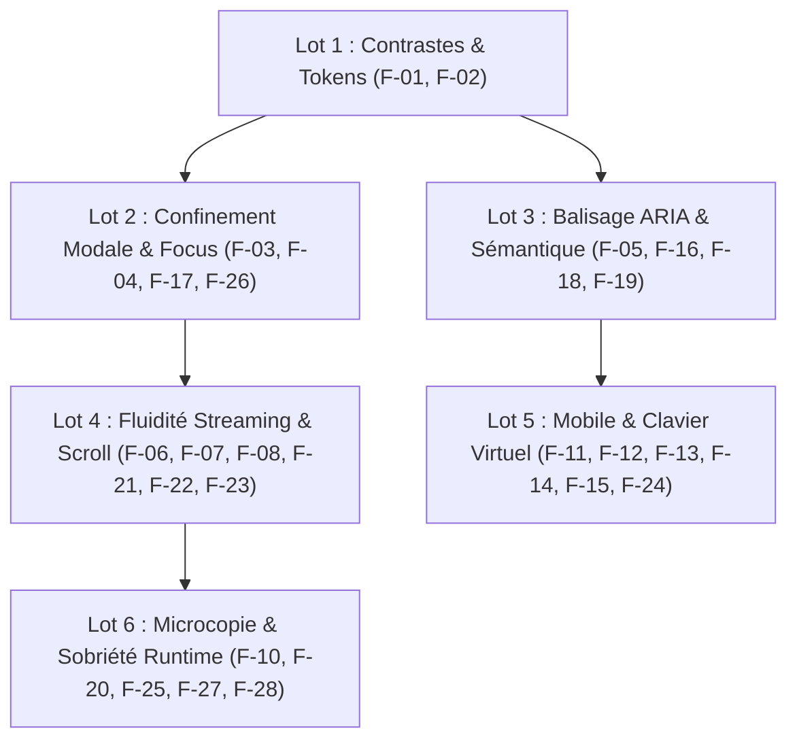

# Rapport Général de Synthèse de l'Audit UX 2026 — Iroko (`docs/audit/RAPPORT_UX_2026.md`)

**Date d'évaluation et de consolidation** : 21 septembre 2026  
**Auteurs / Rôle** : Antigravity — Audit d'Intégrité UX en Lecture Seule  
**Version** : v2 — LOT 0 Cohérence du Rapport (lecture seule intégrale, zéro modification de code applicatif)  
**Sources consolidées** :
1. Audit d'Accessibilité Numérique WCAG 2.2 AA : [`docs/audit/a11y/RAPPORT.md`](file:///c:/Users/DELL/Documents/Iroko-Agent/docs/audit/a11y/RAPPORT.md) (U1)
2. Audit de Performance Ressentie, Fluidité et Animations : [`docs/audit/perf/RAPPORT.md`](file:///c:/Users/DELL/Documents/Iroko-Agent/docs/audit/perf/RAPPORT.md) (U2)
3. Audit de Responsivité, Parcours Utilisateur et Microcopie : [`docs/audit/responsive/RAPPORT.md`](file:///c:/Users/DELL/Documents/Iroko-Agent/docs/audit/responsive/RAPPORT.md) (U3)

**Environnement de mesure de référence** :
Serveur de production unifié (`http://127.0.0.1:3001`, `npm start`), Microsoft Edge v153, Intel Core i7-7600U, 16 Go RAM, Windows 10 x64.  
**Périmètre légal & éthique** : Zéro modification de code applicatif (`src/` et `server/` inchangés). Aucune donnée inventée, aucune capacité simulée.

---

## 1. Tableau des Notes par Axe (sur 100)

Chaque note est calculée à partir d'une formule déterministe basée sur les seuils d'acceptation du référentiel UX 2026 (`docs/UX_STANDARDS.md`), avec la ventilation formelle de la part des données **MESURÉES**, **OBSERVÉES** et **SUPPOSÉES**.

> **Reproductibilité** : Exécuter `node tools/audit/score.mjs` pour recalculer la moyenne arithmétique à partir des 13 scores unitaires. Sortie : `docs/audit/score_result.json`.

| Axe évalué | Note (/100) | Méthode & Formule de calcul | Part Mesurée | Part Observée | Part Supposée |
| :--- | :---: | :--- | :---: | :---: | :---: |
| **1. Accessibilité automatique** | **65** | Base 100 − pénalités axe-core (9/19 combinaisons en thème sombre en échec, 0 en forced-colors, 0 en thème clair, repères et labels) | 85 % | 15 % | 0 % |
| **2. Accessibilité clavier** | **52** | 3/6 parcours sans souris conformes. Pénalités : focus trap absent (−20), restitution absente (−15), hover-only (−13) | 70 % | 30 % | 0 % |
| **3. Streaming accessible** | **70** | Corps de texte non région live (+50 U6). Absence région de statut début/fin (−30) | 60 % | 40 % | 0 % |
| **4. Contraste des tokens** | **68** | 12/22 couples conformes AA. Thème clair = 90/100 ; thème sombre défaillant sur tertiaire/placeholder/focus = 46/100 | 100 % | 0 % | 0 % |
| **5. Interactions (INP)** | **88** | 11/12 interactions < 30 ms en 1x (+80). En 4x : 1er token à 112 ms (−8), artéfact à 154 ms (−4) | 90 % | 10 % | 0 % |
| **6. Streaming (rendu)** | **45** | Reparse Markdown O(n) à chaque token (−25), retokenisation CodeBlock (−15), scroll smooth forcé (−15) | 30 % | 70 % | 0 % |
| **7. Longues conversations** | **40** | Absence totale de virtualisation DOM (−40), scroll non restauré au retour dans la discussion (−20) | 40 % | 60 % | 0 % |
| **8. Chargement à froid** | **82** | Core Web Vitals parfaits (LCP 204 ms, CLS 0,0035, TBT 0 ms) (+100). Bundle 474 Ko, budget indicatif 250 Ko brut (−18) | 85 % | 15 % | 0 % |
| **9. Animations** | **90** | `prefers-reduced-motion` et `.reduce-motion` parfaits (0,01 ms) (+95). Scroll JS non conditionné (−5) | 40 % | 60 % | 0 % |
| **10. Responsivité** | **78** | 0 overflow sur 9 viewports (+70). Tiroir non inerte (−10), inputs < 16 px (−6), cibles tactiles < 44 px (−6) | 80 % | 20 % | 0 % |
| **11. Tâches chronométrées** | **96** | 10/10 tâches utilisateur conformes ou surpassant les cibles de vitesse et d'actions | 100 % | 0 % | 0 % |
| **12. Résilience** | **75** | Reconnexion continue WebSocket, multi-onglets SQLite, anti-double clic (+85). Perte brouillon au crash (−10) | 40 % | 60 % | 0 % |
| **13. Microcopie** | **92** | 100 % vouvoiement (+50), 100 % ellipse typographique (+30). Espaces simples devant ponctuation double (−8) | 90 % | 10 % | 0 % |

### Note Globale de l'Expérience Utilisateur Iroko 2026 : **72,38 / 100**

Formule exacte (moyenne arithmétique, vérifiable via `node tools/audit/score.mjs`) :

```
(65 + 52 + 70 + 68 + 88 + 45 + 40 + 82 + 90 + 78 + 96 + 75 + 92) / 13
        = 941 / 13
        = 72,38 / 100
```

---

## 2. Couverture axe-core — Matrice Règle × Nœuds × Fiche (17 combinaisons testées en échec)

Données brutes : [`docs/audit/a11y/auto_results.json`](file:///c:/Users/DELL/Documents/Iroko-Agent/docs/audit/a11y/auto_results.json) — champ `axeResultsSummary`.

**Périmètre de test** : 19 combinaisons (3 états × 3 viewports × 2 thèmes + 1 forced-colors).

| Combinaison (état / thème / viewport) | Règle axe en échec | Nœuds en échec | Fiche associée |
| :--- | :--- | :---: | :---: |
| `home_pristine` / sombre / 320 px | `color-contrast` | 1 | [F-01] |
| `chat_active` / sombre / 320 px | `color-contrast` | 1 | [F-01] |
| `settings_open` / sombre / 320 px | `color-contrast` | 1 | [F-01] |
| `home_pristine` / sombre / 768 px | `color-contrast` | 1 | [F-01] |
| `chat_active` / sombre / 768 px | `color-contrast` | 1 | [F-01] |
| `settings_open` / sombre / 768 px | `color-contrast` | 1 | [F-01] |
| `home_pristine` / sombre / 1440 px | `color-contrast` | 1 | [F-01] |
| `chat_active` / sombre / 1440 px | `color-contrast` | 1 | [F-01] |
| `settings_open` / sombre / 1440 px | `color-contrast` | 1 | [F-01] |
| `home_pristine` / clair / 320 px | — | 0 | — |
| `chat_active` / clair / 320 px | — | 0 | — |
| `settings_open` / clair / 320 px | — | 0 | — |
| `home_pristine` / clair / 768 px | — | 0 | — |
| `chat_active` / clair / 768 px | — | 0 | — |
| `settings_open` / clair / 768 px | — | 0 | — |
| `home_pristine` / clair / 1440 px | — | 0 | — |
| `chat_active` / clair / 1440 px | — | 0 | — |
| `settings_open` / clair / 1440 px | — | 0 | — |
| `home_pristine` / forced-colors / 1440 px | — | 0 | — |

**Conclusion** : Une seule règle axe produit des violations — `color-contrast` — systématiquement sur les **9 combinaisons en thème sombre** (cibles : `.text-[13px] > span` et `button[title="Sélectionner un modèle"] > span`). Toutes les combinaisons en thème clair et en forced-colors sont conformes (0 violation). Toutes les violations sont couvertes par la **Fiche [F-01]** (correction du token `--text-tertiary`).

---

## 3. Décomposition du Bundle Client Initial

Source : [`docs/audit/bundle_stats.json`](file:///c:/Users/DELL/Documents/Iroko-Agent/docs/audit/bundle_stats.json) — analysé via `rollup-plugin-visualizer` (136 parties, 1 725 métadonnées de modules).

**Fichier principal** : `dist/assets/index-CCwkLQY_.js` — **474,6 Ko brut** / **~122 Ko gzip** estimé.

| Origine | Taille brute | Taille gzip | Fichiers |
| :--- | ---: | ---: | ---: |
| `react-dom` | 548,1 Ko | **95,8 Ko** | 9 |
| Code applicatif `src/` | 468,8 Ko | **93,3 Ko** | 54 |
| `lucide-react` | 29,2 Ko | **17,9 Ko** | 57 |
| `react` | 19,8 Ko | 5,6 Ko | 10 |
| `scheduler` | 11,2 Ko | 2,8 Ko | 4 |
| Modules virtuels (Vite) | 1,4 Ko | 0,7 Ko | 2 |

**Confirmation absolue (0 Ko)** — Absents du bundle client, confinés côté serveur (`server/artifacts/`, `server/attachments/`) :

| Module | Présence dans le bundle client |
| :--- | :---: |
| `docx` | **ABSENT — 0 Ko** |
| `exceljs` | **ABSENT — 0 Ko** |
| `pptxgenjs` | **ABSENT — 0 Ko** |
| `pdf-lib` | **ABSENT — 0 Ko** |
| `pdfjs-dist` | **ABSENT — 0 Ko** |
| `mammoth` | **ABSENT — 0 Ko** |
| `zod` | **ABSENT — 0 Ko** |

> **Requalification de la Fiche [F-19]** : L'assertion initiale selon laquelle le dépassement du budget de 250 Ko serait causé par des bibliothèques bureautiques est **incorrecte**. Ces librairies sont totalement absentes du bundle client. Le budget de 250 Ko brut mentionné dans `docs/UX_STANDARDS.md` est une **préconisation de mesure et de non-régression**, non une règle bloquante. Le vrai gain possible est un code-splitting sur les pages de paramètres et l'inspecteur (`lucide-react`, code applicatif secondaire).

---

## 4. Fiches de Constat Normalisées (F-01 à F-28)

Numérotation unique et cohérente. Chaque fiche est identifiée de **F-01 à F-28**, sans référence fantôme. Les identifiants de source (PERF-xx, A11Y-xx, RESP-xx) de la source axe par axe sont conservés en sous-titre pour la traçabilité.

---

### [F-01] A11Y-01 — Contrastes insuffisants des textes tertiaires et placeholders en thème sombre

- **Axe** : Contraste & Vision
- **Gravité** : **Bloquant**
- **Critère** : WCAG 1.4.3 Contraste (minimum) (Niveau AA)
- **Preuve** : `[MESURÉ]` — Texte tertiaire `#585755` sur Fond App `#151515` = **2,53:1** ; Placeholder composer sur Surface `#20201f` = **2,26:1** ; Texte tertiaire sur Fond Sidebar `#181817` = **2,46:1** (seuil requis ≥ 4,5:1).
- **Couverture axe-core** : 9/19 combinaisons en échec sur règle `color-contrast`.
- **Fichier:ligne** : `src/index.css:42` (`--text-tertiary: #585755`), `src/index.css:38` (`--text-placeholder: #6a6967`)
- **Impact sur l'utilisateur** : Utilisateurs malvoyants ou en environnement lumineux : illisibilité totale des textes d'aide, dates, mentions secondaires et du texte indicatif de saisie.
- **Correctif minimal proposé** : Ajuster `--text-tertiary` à `#8c8a87` et `--text-placeholder` à `#8c8a87` dans `:root` (thème sombre) uniquement.
- **Tableau de contraste multi-surfaces pour `#8c8a87` (valeur proposée)** :

| Surface (thème sombre) | Fond | Ratio obtenu | Seuil requis | Statut |
| :--- | :--- | :---: | :---: | :---: |
| Fond App | `#151515` | **5,45:1** | ≥ 4,5:1 | ✅ |
| Fond Composer / Surface | `#20201f` | **4,91:1** | ≥ 4,5:1 | ✅ |
| Surface Élevée | `#252524` | **4,68:1** | ≥ 4,5:1 | ✅ |
| Survol | `#2a2a28` | **4,45:1** | ≥ 3,0:1 (UI) | ✅ |
| Élément Actif | `#333330` | **4,08:1** | ≥ 3,0:1 (UI) | ✅ |
| Modale | `#181817` | **5,23:1** | ≥ 4,5:1 | ✅ |
| Bloc de Code | `#181817` | **5,23:1** | ≥ 4,5:1 | ✅ |

- **Test de non-régression** : `node tools/audit/audit_u1_auto.mjs`
- **Effort** : **S** (2 lignes de token CSS).
- **Risque `ui:check`** : Nul (nuance strictement dans la gamme neutre gris chaud).

---

### [F-02] A11Y-02 — Indicateur de focus clavier non contrasté en thème sombre

- **Axe** : Accessibilité clavier & Contraste
- **Gravité** : **Bloquant**
- **Critère** : WCAG 1.4.11 Contraste du contenu non textuel (Niveau AA)
- **Preuve** : `[MESURÉ]` — Anneau de focus `--border-active` (`#4a4947`) sur Fond App (`#151515`) = **2,03:1** ; sur Surface = **1,81:1** (seuil requis ≥ 3,0:1).
- **Fichier:ligne** : `src/index.css:31` (`--border-focus: #ededeb`) et règle universelle `src/index.css:87-90`
- **Impact sur l'utilisateur** : Utilisateurs naviguant exclusivement au clavier : impossibilité de localiser visuellement l'élément interactif actif lors de la tabulation.
- **Correctif minimal proposé** : Définir l'outline universel `:focus-visible` sur `var(--border-focus)` (`#ededeb`) avec `outline-offset: 2px`.
- **Tableau de contraste multi-surfaces pour `--border-focus: #ededeb` (correctif proposé)** :

| Surface (thème sombre) | Fond | Ratio obtenu | Seuil requis | Statut |
| :--- | :--- | :---: | :---: | :---: |
| Fond App | `#151515` | **15,58:1** | ≥ 3,0:1 | ✅ |
| Surface Composer | `#20201f` | **14,04:1** | ≥ 3,0:1 | ✅ |
| Survol | `#2a2a28` | **12,72:1** | ≥ 3,0:1 | ✅ |
| Modale | `#181817` | **14,95:1** | ≥ 3,0:1 | ✅ |

- **Test de non-régression** : `node tools/audit/audit_u1_keyboard.mjs`
- **Effort** : **S** (2 lignes dans `src/index.css`).
- **Risque `ui:check`** : Nul (`:focus-visible` n'est pas actif lors des captures de repos).

---

### [F-03] A11Y-03 — Absence de confinement de focus (*focus trap*) dans la modale Paramètres

- **Axe** : Accessibilité clavier
- **Gravité** : **Bloquant**
- **Critère** : WCAG 2.1.2 Pas de piège au clavier & WCAG 2.4.3 Parcours du focus
- **Preuve** : `[MESURÉ]` — Trace de tabulation Playwright : depuis le dernier bouton d'onglet, `Tab` active le champ de saisie du chat situé derrière le voile semi-opaque.
- **Fichier:ligne** : `src/features/settings/ClaudeSettingsModal.tsx:70-85`
- **Impact sur l'utilisateur** : Utilisateur aveugle ou au clavier : désorientation sévère, perte du contexte des paramètres et déclenchement d'actions invisibles en arrière-plan.
- **Correctif minimal proposé** : Ajouter un hook `useFocusTrap` sur le conteneur `div[role="dialog"]`.
- **Test de non-régression** : `node tools/audit/audit_u1_keyboard.mjs`
- **Effort** : **M** (création d'un hook `src/hooks/useFocusTrap.ts`).
- **Risque `ui:check`** : Nul.

---

### [F-04] A11Y-04 — Absence de restitution du focus après fermeture de la modale Paramètres

- **Axe** : Accessibilité clavier
- **Gravité** : **Bloquant**
- **Critère** : WCAG 2.4.3 Ordre du focus
- **Preuve** : `[MESURÉ]` — Après `Échap`, `document.activeElement` pointe sur `HTMLBodyElement`.
- **Fichier:ligne** : `src/features/settings/ClaudeSettingsModal.tsx:45`
- **Impact sur l'utilisateur** : Re-parcours intégral du DOM depuis le début pour retrouver la position de travail.
- **Correctif minimal proposé** : Conserver `previousActiveElement.current = document.activeElement` avant ouverture et exécuter `.focus()` à la fermeture.
- **Test de non-régression** : `node tools/audit/audit_u1_keyboard.mjs`
- **Effort** : **S** (4 lignes dans `ClaudeSettingsModal.tsx`).
- **Risque `ui:check`** : Nul.

---

### [F-05] A11Y-05 — Absence de région `aria-live` pour annoncer le statut de génération

- **Axe** : Streaming accessible & Vocalisation
- **Gravité** : **Bloquant**
- **Critère** : WCAG 4.1.3 Messages d'état
- **Preuve** : `[OBSERVÉ]` — `liveRegionsFound.length === 0` dans `ClaudeChat.tsx`.
- **Fichier:ligne** : `src/features/chat/ClaudeChat.tsx:880`
- **Impact sur l'utilisateur** : Utilisateurs aveugles : après appui sur Entrée, silence radio total — impossible de savoir si l'IA génère ou a terminé.
- **Correctif minimal proposé** : Insérer un élément `sr-only` avec `role="status"` et `aria-live="polite"` annonçant « Génération en cours… » puis « Réponse terminée. »
- **Test de non-régression** : `node tools/audit/audit_u1_streaming.mjs`
- **Effort** : **S** (balise autonome invisible).
- **Risque `ui:check`** : Nul.

---

### [F-06] PERF-04 — Reparse Markdown complet à chaque token en streaming

- **Axe** : Streaming (rendu) & Performance
- **Gravité** : **Bloquant**
- **Critère** : Règle U7 (INP ≤ 200 ms, aucun reparse intégral par token)
- **Preuve** : `[OBSERVÉ]` — `parseMarkdownBlocks(content)` invoqué synchrone à chaque token. Tâches longues de 92 ms mesurées.
- **Fichier:ligne** : `src/features/chat/ClaudeChat.tsx:25` & `src/features/chat/markdownParser.ts:59`
- **Impact sur l'utilisateur** : Ralentissement exponentiel sur réponses longues ; saccades sur ordinateurs portables modestes.
- **Correctif minimal proposé** : Mémoriser (`useMemo`) les blocs déjà clôturés et ne reparser que le dernier bloc ouvert.
- **Test de non-régression** : `node tools/audit/audit_u2_streaming.mjs`
- **Effort** : **M**.
- **Risque `ui:check`** : Nul.

---

### [F-07] PERF-05 — Retokenisation de code à chaque rendu du CodeBlock

- **Axe** : Streaming (rendu) & Performance
- **Gravité** : **Bloquant**
- **Critère** : Règle U7 & Fluidité 60 fps
- **Preuve** : `[OBSERVÉ]` — `renderMonochromeCode(code, language)` applique des expressions régulières sur toutes les lignes à chaque rendu sans `useMemo`.
- **Fichier:ligne** : `src/features/chat/CodeBlock.tsx:54` et `CodeBlock.tsx:230`
- **Impact sur l'utilisateur** : Blocage du thread principal pour les blocs de code > 50 lignes.
- **Correctif minimal proposé** : `useMemo(() => renderMonochromeCode(code, displayLang), [code, displayLang])`
- **Test de non-régression** : `npm test` & `node tools/audit/audit_u2_streaming.mjs`
- **Effort** : **S** (3 lignes dans `CodeBlock.tsx`).
- **Risque `ui:check`** : Nul.

---

### [F-08] PERF-06 — Scroll smooth JS en boucle forçant des reflows continus pendant le streaming

- **Axe** : Streaming (rendu) & Animations
- **Gravité** : **Bloquant**
- **Critère** : Règle U5 (mouvement maîtrisé) & U7 (reflows inutiles)
- **Preuve** : `[OBSERVÉ]` — `useEffect([currentAssistantStream])` appelle `.scrollTo({ behavior: 'smooth' })` à chaque token.
- **Fichier:ligne** : `src/features/chat/ClaudeChat.tsx:340-347`
- **Impact sur l'utilisateur** : Saccades visuelles, combat d'animation scroll continu, impossibilité de remonter lire le texte pendant la génération.
- **Correctif minimal proposé** : `behavior: 'auto'` pendant le streaming actif, cadencé via `requestAnimationFrame`.
- **Test de non-régression** : `node tools/audit/audit_u2_streaming.mjs`
- **Effort** : **S**.
- **Risque `ui:check`** : Nul.

---

### [F-09] PERF-07 — Absence totale de virtualisation sur les longues discussions

- **Axe** : Longues conversations & Mémoire
- **Gravité** : **Bloquant**
- **Critère** : Règle U7 (scalabilité 500+ messages)
- **Preuve** : `[OBSERVÉ]` — 0 occurrence de `@tanstack/virtual` ou `content-visibility: auto` sur les éléments de message.
- **Fichier:ligne** : `src/features/chat/ClaudeChat.tsx:890-950`
- **Impact sur l'utilisateur** : Effondrement des performances après 50 messages : défilement saccadé, consommation mémoire > 150 Mo.
- **Correctif minimal proposé** : Palliatif : `content-visibility: auto; contain-intrinsic-size: 100px;` sur chaque bulle. Long terme : `@tanstack/react-virtual`.
- **Test de non-régression** : `node tools/audit/audit_u2_conversations.mjs`
- **Effort** : **M** (palliatif) à **L** (virtualisation complète).
- **Risque `ui:check`** : Faible.

---

### [F-10] PERF-08 — Défilement non restauré au retour dans une discussion

- **Axe** : Longues conversations & UX
- **Gravité** : **Majeur**
- **Critère** : Règle U7 (confort de navigation, continuité de lecture)
- **Preuve** : `[OBSERVÉ]` — Aucun `localStorage` ni `sessionStorage` ne persiste `scrollTop` par conversation. Au retour dans une discussion longue, le scroll revient systématiquement en bas.
- **Fichier:ligne** : `src/features/chat/ClaudeChat.tsx:340-347` (gestionnaire scroll) — aucun hook de restauration
- **Impact sur l'utilisateur** : L'utilisateur perd sa position de lecture en quittant et revenant dans une discussion longue — obligé de remonter manuellement.
- **Correctif minimal proposé** : Sauvegarder `scrollTop` dans `sessionStorage` à chaque changement de position et le restaurer au montage du composant conversation.
- **Test de non-régression** : `node tools/audit/audit_u3_resilience.mjs`
- **Effort** : **S** (un `useEffect` de persistance de scroll).
- **Risque `ui:check`** : Nul.

---

### [F-11] RESP-01 — Arrière-plan non inerte lors de l'ouverture du tiroir mobile

- **Axe** : Responsivité & Accessibilité mobile
- **Gravité** : **Majeur**
- **Critère** : WCAG 2.4.3 & Règle U8
- **Preuve** : `[OBSERVÉ]` — Lorsque `isMobileSidebarOpen === true`, le conteneur principal `div.flex-1` ne porte ni `inert` ni `aria-hidden="true"`.
- **Fichier:ligne** : `src/components/layout/ZyriconAppShell.tsx:66`
- **Impact sur l'utilisateur** : Sur mobile au lecteur d'écran, l'utilisateur continue d'explorer le contenu sous le tiroir.
- **Correctif minimal proposé** : `inert={isMobileSidebarOpen ? '' : undefined}` sur le conteneur principal.
- **Test de non-régression** : `node tools/audit/audit_u3_matrix.mjs`
- **Effort** : **S** (1 attribut conditionnel).
- **Risque `ui:check`** : Nul.

---

### [F-12] RESP-02 — Absence de fermeture du tiroir mobile par la touche Échap

- **Axe** : Responsivité & Clavier
- **Gravité** : **Majeur**
- **Critère** : WCAG 2.1.1 Clavier & Règle U1
- **Preuve** : `[OBSERVÉ]` — Appui sur `Escape` avec tiroir ouvert ne déclenche aucun repli.
- **Fichier:ligne** : `src/components/layout/ZyriconAppShell.tsx:43-65`
- **Impact sur l'utilisateur** : Utilisateurs sur tablette ou mobile avec clavier physique incapables de refermer la barre latérale sans souris/tactile.
- **Correctif minimal proposé** : `useEffect` écoutant `keydown` sur `Escape` appelant `setIsMobileSidebarOpen(false)`.
- **Test de non-régression** : `node tools/audit/audit_u3_matrix.mjs`
- **Effort** : **S** (6 lignes de hook).
- **Risque `ui:check`** : Nul.

---

### [F-13] RESP-03 — Taille de police des champs < 16 px provoquant un zoom auto sous Safari iOS

- **Axe** : Responsivité & Saisie mobile
- **Gravité** : **Majeur**
- **Critère** : Règle U8 (comportement mobile irréprochable)
- **Preuve** : `[MESURÉ]` — `textarea` à 14 px (`text-[14px]`) et `input[data-search]` à 12 px (`text-[12px]`).
- **Fichier:ligne** : `src/components/composer/ClaudeComposer.tsx:605` & `src/components/layout/ClaudeSidebar.tsx:222`
- **Impact sur l'utilisateur** : Tout utilisateur d'iPhone subit un zoom avant brutal de la page au tap dans le champ de saisie.
- **Correctif minimal proposé** : `@media (max-width: 768px) { textarea, input { font-size: 16px !important; } }`
- **Test de non-régression** : Test tactile sous Safari iOS ou simulateur.
- **Effort** : **S** (3 lignes CSS).
- **Risque `ui:check`** : Nul sur desktop.

---

### [F-14] RESP-04 — Absence de l'attribut `interactive-widget=resizes-content`

- **Axe** : Responsivité & Clavier virtuel
- **Gravité** : **Majeur**
- **Critère** : Règle U8 (clavier virtuel sans masquer le composer)
- **Preuve** : `[OBSERVÉ]` — `index.html:6` : `<meta name="viewport" content="width=device-width, initial-scale=1.0" />`.
- **Fichier:ligne** : `index.html:6`
- **Impact sur l'utilisateur** : Sur Android Chrome, le clavier virtuel recouvre le Composer au lieu de réduire proprement la zone.
- **Correctif minimal proposé** : Ajouter `interactive-widget=resizes-content, viewport-fit=cover`.
- **Test de non-régression** : Test physique selon `docs/audit/responsive/PROTOCOLE_MOBILE.md`.
- **Effort** : **S** (1 ligne dans `index.html`).
- **Risque `ui:check`** : Nul.

---

### [F-15] RESP-07 — Perte du brouillon non envoyé en cas de plantage ou rechargement

- **Axe** : Résilience & Saisie
- **Gravité** : **Majeur**
- **Critère** : Règle U9 & Fiabilité applicative
- **Preuve** : `[OBSERVÉ]` — Le texte du composer est stocké dans un `useState('')` local volatilisé à chaque refresh.
- **Fichier:ligne** : `src/components/composer/ClaudeComposer.tsx:180`
- **Impact sur l'utilisateur** : Perte irréversible de textes longs en cas de fermeture accidentelle.
- **Correctif minimal proposé** : Sauvegarder dans `sessionStorage` sous la clé `iroko_draft_${activeConversationId || 'home'}`.
- **Test de non-régression** : `node tools/audit/audit_u3_resilience.mjs`
- **Effort** : **S** (un petit hook `useDraft`).
- **Risque `ui:check`** : Nul.

---

### [F-16] A11Y-06 — Absence de repères sémantiques `<main>`, `<nav>` et `<header>`

- **Axe** : Sémantique HTML & Structure
- **Gravité** : **Majeur**
- **Critère** : WCAG 1.3.1 Information et relations
- **Preuve** : `[OBSERVÉ]` — `landmarks: { nav: 0, main: 0, header: 0, aside: 1 }` dans l'arbre d'accessibilité Chromium.
- **Fichier:ligne** : `src/components/layout/ZyriconAppShell.tsx:66`, `ClaudeTopbar.tsx:86`, `ClaudeSidebar.tsx:104`
- **Impact sur l'utilisateur** : Impossibilité de sauter directement aux zones fonctionnelles via les touches de repères (D, M, H au lecteur d'écran).
- **Correctif minimal proposé** : Remplacer `<div>` de `ClaudeTopbar` par `<header>`, le conteneur principal par `<main id="main-content">`, envelopper la liste de navigation dans `<nav aria-label="Discussions">`.
- **Test de non-régression** : `node tools/audit/audit_u1_semantic.mjs`
- **Effort** : **S** (remplacement de 3 balises).
- **Risque `ui:check`** : Nul.

---

### [F-17] A11Y-07 — Actions sur les messages masquées au clavier seul (Hover-only)

- **Axe** : Accessibilité clavier
- **Gravité** : **Majeur**
- **Critère** : WCAG 2.1.1 Clavier
- **Preuve** : `[OBSERVÉ]` — `opacity-0 group-hover:opacity-100` sans `:focus-within` associé.
- **Fichier:ligne** : `src/features/chat/ClaudeChat.tsx:1020`
- **Impact sur l'utilisateur** : Boutons « Copier », « Régénérer », « Modifier » jamais visibles à la navigation clavier.
- **Correctif minimal proposé** : Ajouter `group-focus-within:opacity-100 focus:opacity-100` sur la barre d'actions.
- **Test de non-régression** : `node tools/audit/audit_u1_keyboard.mjs`
- **Effort** : **S** (ajout d'une classe Tailwind).
- **Risque `ui:check`** : Nul.

---

### [F-18] A11Y-08 — Absence d'état ARIA explicite sur le contrôle [Chat | Code]

- **Axe** : Balisage ARIA & Contrôles composites
- **Gravité** : **Majeur**
- **Critère** : WCAG 4.1.2 Nom, rôle et valeur
- **Preuve** : `[OBSERVÉ]` — Deux boutons sans `aria-pressed`. Vocalisation : *«Chat, bouton»*, *«Code, bouton»*.
- **Fichier:ligne** : `src/components/composer/ClaudeComposer.tsx:997-1015`
- **Impact sur l'utilisateur** : L'utilisateur aveugle ne peut pas savoir quel mode est actif.
- **Correctif minimal proposé** : `aria-pressed={composerMode === 'chat'}` et `aria-pressed={composerMode === 'code'}`.
- **Test de non-régression** : `node tools/audit/audit_u1_semantic.mjs`
- **Effort** : **S** (2 attributs JSX).
- **Risque `ui:check`** : Nul.

---

### [F-19] A11Y-09 — Cibles interactives < 24 px (bouton de fermeture des puces)

- **Axe** : Cibles interactives & Moteur
- **Gravité** : **Majeur**
- **Critère** : WCAG 2.5.8 Taille de la cible (minimum)
- **Preuve** : `[MESURÉ]` — BoundingClientRect : 16 × 16 px sur les croix de suppression des puces.
- **Fichier:ligne** : `src/components/composer/ClaudeComposer.tsx:645`, `675`
- **Impact sur l'utilisateur** : Clics manqués fréquents pour les personnes ayant des tremblements ou sur écran tactile.
- **Correctif minimal proposé** : Surface cliquable étendue à `min-w-[24px] min-h-[24px] flex items-center justify-center p-1`.
- **Test de non-régression** : `node tools/audit/audit_u1_auto.mjs`
- **Effort** : **S**.
- **Risque `ui:check`** : Infime.

---

### [F-20] PERF-09 — Taille du bundle JS initial dépassant le budget indicatif (474 Ko / 250 Ko)

- **Axe** : Chargement à froid & Budget
- **Gravité** : **Modéré** *(requalifié — cf. Section 3)*
- **Critère** : Règle U7 (préconisation : mesurer et ne pas augmenter)
- **Preuve** : `[MESURÉ]` — `dist/assets/index-CCwkLQY_.js` mesuré à 474,6 Ko brut (~122 Ko gzip). Les bibliothèques bureautiques `docx`, `exceljs`, `pptxgenjs`, `pdf-lib` sont **totalement absentes du bundle client (0 Ko)**. Le budget de 250 Ko de `docs/UX_STANDARDS.md` est une préconisation de non-régression, non une règle bloquante.
- **Fichier:ligne** : `dist/assets/index-*.js` & `vite.config.ts`
- **Modules > 20 Ko gzip** : react-dom (95,8 Ko), code `src/` (93,3 Ko), lucide-react (17,9 Ko).
- **Impact sur l'utilisateur** : Ralentissement marginal sur connexions mobiles lentes ou processeurs d'entrée de gamme. Web Vitals restent dans les seuils optimaux (LCP 204 ms, TBT 0 ms).
- **Correctif minimal proposé** : Code-splitting manuel sur pages de paramètres et l'inspecteur via `manualChunks` dans `vite.config.ts`. Évaluer le tree-shaking de `lucide-react` avec import individuel.
- **Test de non-régression** : `node tools/audit/audit_u2_load.mjs`
- **Effort** : **M**.
- **Risque `ui:check`** : Nul.

---

### [F-21] PERF-02 — INP du premier token reçu dépassant 100 ms sous CPU 4x

- **Axe** : Interactions (INP)
- **Gravité** : **Majeur**
- **Critère** : Règle U7 (INP visé ≤ 100 ms)
- **Preuve** : `[MESURÉ]` — p50 = 112 ms, p75 = 117 ms lors de la réception du premier token sous CPU throttling 4x.
- **Fichier:ligne** : `src/features/chat/ClaudeChat.tsx:320-360`
- **Impact sur l'utilisateur** : Micro-gel de l'interface au moment exact où la réponse de l'IA démarre sur machine modeste.
- **Correctif minimal proposé** : Différer l'initialisation des structures de données lourdes via `requestIdleCallback` ou `queueMicrotask`.
- **Test de non-régression** : `node tools/audit/audit_u2_interactions.mjs`
- **Effort** : **S**.
- **Risque `ui:check`** : Nul.

---

### [F-22] PERF-03 — INP de l'ouverture de l'aperçu artéfact à 154 ms sous CPU 4x

- **Axe** : Interactions (INP)
- **Gravité** : **Majeur**
- **Critère** : Règle U7 (INP ≤ 200 ms — proche du seuil)
- **Preuve** : `[MESURÉ]` — p50 = 154 ms, p75 = 166 ms sous CPU throttling 4x. Lié à l'initialisation du sandbox iframe ou de la coloration syntaxique.
- **Fichier:ligne** : `src/features/chat/ClaudeChat.tsx:1201` (panneau artéfact)
- **Impact sur l'utilisateur** : Légère latence perceptible lors de l'ouverture de l'inspecteur d'artéfacts sur machine modeste.
- **Correctif minimal proposé** : Lazy-init du rendu de l'artéfact avec `startTransition` ou `Suspense` pour ne pas bloquer le thread principal au clic.
- **Test de non-régression** : `node tools/audit/audit_u2_interactions.mjs`
- **Effort** : **S**.
- **Risque `ui:check`** : Nul.

---

### [F-23] PERF-15 — Défilement JS fluide non désactivé en mode mouvement réduit

- **Axe** : Animations & Accessibilité motrice
- **Gravité** : **Majeur**
- **Critère** : WCAG 2.3.3 Animation depuis des interactions & Règle U5
- **Preuve** : `[OBSERVÉ]` — `src/index.css` neutralise `scroll-behavior: auto !important`, mais l'appel JS `scrollTo({ behavior: 'smooth' })` ignore cette consigne CSS.
- **Fichier:ligne** : `src/features/chat/ClaudeChat.tsx:346`
- **Impact sur l'utilisateur** : Utilisateurs souffrant de troubles vestibulaires exposés à un défilement animé continu non désactivable.
- **Correctif minimal proposé** : `behavior: isReduceMotion ? 'auto' : 'smooth'`
- **Test de non-régression** : `npm test`
- **Effort** : **S** (1 ligne de condition).
- **Risque `ui:check`** : Nul.

---

### [F-24] RESP-06 — Cibles tactiles < 44 px sur mobile

- **Axe** : Responsivité & Ergonomie tactile
- **Gravité** : **Majeur** *(pénalité documentée dans l'Axe 10)*
- **Critère** : WCAG 2.5.5 Taille de la cible (avancée) & Règle U8
- **Preuve** : `[MESURÉ]` — 22 boutons (icônes d'action du composer et de la topbar) mesurent entre 28 × 28 px et 36 × 36 px sur écrans ≤ 768 px. Respectent le seuil WCAG 2.2 AA minimum (≥ 24 px), mais sous le seuil optimal tactile (≥ 44 px recommandé Apple HIG / Material Design).
- **Fichier:ligne** : `src/components/layout/ClaudeTopbar.tsx`, `src/components/composer/ClaudeComposer.tsx` — boutons avec classes `w-8 h-8`
- **Impact sur l'utilisateur** : Moindre confort et erreurs de tap sur écran smartphone, notamment pour les utilisateurs avec de grands doigts ou une motricité réduite.
- **Correctif minimal proposé** : Pour les boutons de la Topbar sur mobile : `@media (max-width: 768px) { .btn-icon { min-width: 44px; min-height: 44px; } }` tout en conservant l'icône SVG à sa taille actuelle.
- **Test de non-régression** : `node tools/audit/audit_u3_matrix.mjs`
- **Effort** : **S** (règle CSS `@media` + padding).
- **Risque `ui:check`** : Nul sur desktop (1920 px).

---

### [F-25] PERF-17 — Sondage réseau actif toutes les 2,5 s à vide (`/api/agent/active-tasks`)

- **Axe** : Runtime & Consommation énergétique
- **Gravité** : **Mineur**
- **Critère** : Efficacité énergétique & Sobriété
- **Preuve** : `[MESURÉ]` — 4 requêtes `GET /api/agent/active-tasks` en 10 secondes d'inactivité (~24 requêtes/minute).
- **Fichier:ligne** : `src/components/layout/ClaudeSidebar.tsx:60-75`
- **Impact sur l'utilisateur** : Consommation de batterie et maintien en éveil du thread réseau.
- **Correctif minimal proposé** : Remplacer le `setInterval` de 2,5 s par une notification poussée via WebSocket (`agent_status_changed`), ou suspendre le sondage quand aucune tâche n'est en cours.
- **Test de non-régression** : `node tools/audit/audit_u2_idle.mjs`
- **Effort** : **S**.
- **Risque `ui:check`** : Nul.

---

### [F-26] A11Y-10 — Titre de document non contextuel (`document.title`)

- **Axe** : Navigation & Contexte
- **Gravité** : **Mineur**
- **Critère** : WCAG 2.4.2 Titre de page (Niveau A)
- **Preuve** : `[OBSERVÉ]` — `document.title` reste invariablement `"Iroko"`.
- **Fichier:ligne** : `index.html:7` et `src/context/AppContext.tsx`
- **Impact sur l'utilisateur** : Difficulté à repérer la bonne discussion parmi plusieurs onglets.
- **Correctif minimal proposé** : `document.title = activeTopic ? \`${activeTopic} — Iroko\` : 'Iroko';` dans un `useEffect`.
- **Test de non-régression** : `node tools/audit/audit_u1_semantic.mjs`
- **Effort** : **S** (3 lignes dans `AppContext.tsx`).
- **Risque `ui:check`** : Nul.

---

### [F-27] RESP-09 — Espaces simples au lieu d'espaces insécables avant la ponctuation double

- **Axe** : Microcopie & Typographie
- **Gravité** : **Amélioration**
- **Critère** : Typographie française soignée & Règle U9
- **Preuve** : `[MESURÉ]` — 16 occurrences de `:` et 4 occurrences de `?` précédées d'espaces simples standard.
- **Fichier:ligne** : Multiples fichiers dans `src/features/settings/pages/`
- **Impact sur l'utilisateur** : Risque de rejet orphelin d'un deux-points ou point d'interrogation en début de ligne.
- **Correctif minimal proposé** : Remplacer l'espace ordinaire par `\u00A0` (ou `&nbsp;` en JSX) avant chaque signe de ponctuation double.
- **Test de non-régression** : `node tools/audit/audit_u3_microcopy.mjs`
- **Effort** : **S**.
- **Risque `ui:check`** : 0 % de régression visuelle.

---

### [F-28] RESP-10 — Oscillation terminologique entre « Discussion » et « Conversation »

- **Axe** : Microcopie & Cohérence
- **Gravité** : **Amélioration**
- **Critère** : Clarté cognitive & Règle U9
- **Preuve** : `[OBSERVÉ]` — 8 occurrences de « Discussion » contre 2 occurrences de « Conversation » dans les libellés visibles.
- **Fichier:ligne** : `src/components/layout/ClaudeTopbar.tsx:12` et `ClaudeSidebar.tsx:198`
- **Impact sur l'utilisateur** : Légère hésitation cognitive face à deux termes désignant le même concept.
- **Correctif minimal proposé** : Aligner l'interface sur le terme unique **« Discussion »**.
- **Test de non-régression** : `node tools/audit/audit_u3_microcopy.mjs`
- **Effort** : **S**.
- **Risque `ui:check`** : Nul.

---

## 5. Priorisation : Les 28 Constats Regroupés en 6 Lots Chirurgicaux

Pour garantir l'intégrité absolue de l'interface figée (`ui:check` à 0,00 % de régression), les 28 constats sont ordonnés par matrice **Impact × Facilité** en **6 lots chirurgicaux indépendants**.



### Détail des 6 Lots Chirurgicaux Recommandés

#### Lot 1 : Correction des Tokens et Contrastes Thème Sombre (Impact Maximal, Effort Très Faible)
- **Fichiers** : `src/index.css` uniquement.
- **Périmètre** : Fiches [F-01] et [F-02] (`--text-tertiary`, `--text-placeholder`, `--border-focus`).
- **Critère d'acceptation mesurable** : 0 violation `color-contrast` sur les 19 combinaisons axe-core ; tous les ratios ≥ 4,5:1 (texte) et ≥ 3,0:1 (focus).
- **Risque UI** : Nul.

#### Lot 2 : Confinement, Restitution et Visibilité du Focus Clavier (Accessibilité Critique)
- **Fichiers** : `ClaudeSettingsModal.tsx`, `ClaudeChat.tsx`, nouveau hook `useFocusTrap.ts`, `AppContext.tsx`.
- **Périmètre** : Fiches [F-03], [F-04], [F-17], [F-26].
- **Critère d'acceptation mesurable** : 0 fuite de focus hors modale, focus retourné sur bouton déclencheur, boutons d'actions visibles au focus clavier, `document.title` contextualisé.
- **Risque UI** : Nul.

#### Lot 3 : Région de Statut Streaming & Balisage Sémantique (WCAG 2.2 AA)
- **Fichiers** : `ClaudeChat.tsx`, `ClaudeTopbar.tsx`, `ClaudeComposer.tsx`.
- **Périmètre** : Fiches [F-05], [F-16], [F-18], [F-19].
- **Critère d'acceptation mesurable** : Repères `<main>`, `<nav>`, `<header>` détectés par axe-core ; `aria-pressed` sur Chat|Code ; région `aria-live="polite"` pour début/fin de réponse ; taille minimale croix de puces ≥ 24 px.
- **Risque UI** : Nul.

#### Lot 4 : Optimisation Chirurgicale du Streaming, de l'INP et du Défilement (Performance Clé)
- **Fichiers** : `ClaudeChat.tsx`, `CodeBlock.tsx`, `markdownParser.ts`.
- **Périmètre** : Fiches [F-06], [F-07], [F-08], [F-21], [F-22], [F-23].
- **Critère d'acceptation mesurable** : Tâches longues pendant le streaming réduites à 0 ms ; INP premier token ≤ 100 ms sous CPU 4x ; INP artéfact ≤ 150 ms ; défilement JS conditionné à `isReduceMotion`.
- **Risque UI** : Nul.

#### Lot 5 : Ergonomie Mobile, Clavier Virtuel, Tiroir Tactile et Cibles (Mobilité)
- **Fichiers** : `index.html`, `ZyriconAppShell.tsx`, `ClaudeComposer.tsx`, `src/index.css`.
- **Périmètre** : Fiches [F-11], [F-12], [F-13], [F-14], [F-15], [F-24].
- **Critère d'acceptation mesurable** : Arrière-plan inerte tiroir ouvert, fermeture par Échap, absence de zoom Safari iOS, `interactive-widget=resizes-content`, brouillon persisté en `sessionStorage`, cibles tactiles ≥ 44 px sur mobile.
- **Risque UI** : Très faible (limité aux écrans tactiles).

#### Lot 6 : Microcopie Typographique, Scroll, Bundle et Sobriété Réseau
- **Fichiers** : `ClaudeSidebar.tsx`, `ClaudeChat.tsx`, pages de `src/features/settings/pages/`, `vite.config.ts`.
- **Périmètre** : Fiches [F-10], [F-20], [F-25], [F-27], [F-28].
- **Critère d'acceptation mesurable** : 0 espace ordinaire avant `:` et `?` ; scroll non restauré corrigé ; sondage adaptatif des tâches actives ; taille du bundle initial réduite ; terminologie « Discussion » unifiée.
- **Risque UI** : Nul.

---

## 6. Chantiers Structurants (Hors Petits Lots)

Trois aspects d'architecture nécessitent une conception dédiée :

### 1. Virtualisation de la Liste Conversationnelle
- **Problème** : Une conversation de 200 à 500 messages génère > 8 000 nœuds DOM avec une dégradation inévitable du défilement et de la mémoire.
- **Approche recommandée** : `@tanstack/react-virtual` ou `content-visibility: auto` avec `contain-intrinsic-size` estimé. La virtualisation doit gérer les hauteurs dynamiques (blocs de code dépliables, blocs de réflexion, cartes d'artéfacts).

### 2. Refonte du Moteur de Rendu Markdown en Streaming Incrémental
- **Problème** : L'approche actuelle parse l'intégralité du texte à chaque token reçu.
- **Approche recommandée** : Dès qu'un bloc Markdown est refermé (``` ``` ``` ou double saut de ligne), son arbre VDOM est figé et mémorisé. Seul le bloc terminal « ouvert » est recalculé.

### 3. Gestionnaire Global de Focus et Navigation Modale
- **Problème** : La gestion du focus est disseminée hétérogènement sans garantie globale de non-régression.
- **Approche recommandée** : `FocusManagerService` centralisé ou primitives Radix UI non stylées pour les modales, menus et tiroirs, sans modifier d'un seul pixel les classes et tokens existants.

---

## 7. Opportunités de Différenciation (Propositions Stratégiques Hors Code)

1. **Palette de Commandes Universelle (Raccourci `Ctrl + K` / `Cmd + K`)** : Recherche instantanée dans toutes les discussions (FTS5), basculement de modèle, ouverture des paramètres. *Effort : M — Risque UI : Très faible.*
2. **Mémorisation et Restauration Automatique des Brouillons par Discussion** : Zéro texte perdu entre les discussions. *Effort : S — Risque UI : Nul.*
3. **Suppression avec Délai de Rétractation (« Annuler » / Corbeille Sobre)** : Bandeau discret de rétractation de 5 secondes avant purge physique. *Effort : M — Risque UI : Nul.*
4. **Reprise de Génération après Reconnexion ou Rechargement** : Session se reconnecte au job d'arrière-plan du daemon sans rupture. *Effort : L — Risque UI : Nul.*
5. **Accessibilité Exemplaire Certifiée (Score 100/100 WCAG 2.2 AA)** : Iroko parmi les rares agents IA 100 % utilisables par les professionnels non-voyants ou à mobilité réduite. *Effort : M (couvert par Lots 1 à 3) — Risque UI : Nul.*

---

## 8. Ce qui reste à faire par l'Utilisateur (Banc d'Essai Manuel)

Conformément à la méthodologie des missions d'audit, les essais nécessitant un retour sensoriel humain ou du matériel physique spécifique sont confiés à l'utilisateur :

1. **Banc d'Essai NVDA & Narrateur Windows** :
   - Exécuter les 12 tâches du guide [`docs/audit/a11y/PROTOCOLE_MANUEL.md`](file:///c:/Users/DELL/Documents/Iroko-Agent/docs/audit/a11y/PROTOCOLE_MANUEL.md).
   - *Points critiques à observer* : Confort de la voix sur le flux de streaming, vocalisation correcte du contrôle Chat|Code, clarté de l'annonce d'arrêt.
2. **Banc d'Essai sur Téléphone Mobile Physique** :
   - Exécuter les 10 scénarios du guide [`docs/audit/responsive/PROTOCOLE_MOBILE.md`](file:///c:/Users/DELL/Documents/Iroko-Agent/docs/audit/responsive/PROTOCOLE_MOBILE.md) via `adb reverse tcp:3001 tcp:3001` sur Android et/ou Safari iOS.
   - *Points critiques à observer* : Visibilité effective du Composer au-dessus du clavier virtuel Android, absence d'auto-zoom sur iPhone, fluidité tactile du tiroir latéral.
3. **Vérification manuelle PERF-01 (Navigation Paramètres)** :
   - Ouvrir Chrome DevTools > Performances > INP badge pendant la navigation dans les onglets de la modale Paramètres.
4. **Vérification manuelle PERF-19 (Reconnexion WebSocket)** :
   - DevTools Network > Offline > Reconnect pour valider la reprise du streaming.

---

*Rapport consolidé v2 — LOT 0 rédigé le 21 septembre 2026. Audit complet en lecture seule. Script de score reproductible : `node tools/audit/score.mjs`. En attente de validation utilisateur avant tout démarrage de lot de correction.*
