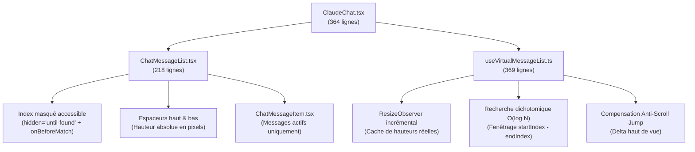

# Rapport d'Audit & Validation — Mission R5b : Virtualisation de la Liste de Messages

**Date** : 27 septembre 2026  
**Statut** : ✅ **Validé et Opérationnel**  
**Suites de tests** : 434/434 PASS (0 régression) | `npm run ui:check` : 7/7 PASS | Typage strict & Build : 0 erreur  

---

## 1. Contexte & Objectifs de la Mission R5b

À l'issue de l'audit R5a sur les très longues conversations (200, 1000, 3000 et 5000 messages), un goulot d'étranglement majeur a été mis en évidence au-delà de 1 000 messages :
- **À 5 000 messages sans virtualisation** : 214 023 nœuds DOM simultanés, 12,04 secondes de blocage de l'UI à l'ouverture sous CPU bridé $\times 4$, et une consommation mémoire Heap JS de 187,26 Mo (dépassant le budget de 150 Mo).

**Objectifs stricts de la Mission R5b** :
1. Implémenter un moteur de virtualisation sur mesure capable de gérer les hauteurs dynamiques (blocs de code repliables, réflexions, cartes d'artéfacts, streaming en direct) sans aucun saut de défilement (*scroll jump*).
2. Préserver l'ancrage et la restauration de position (Lot 7) ainsi que le suivi automatique (*stick-to-bottom*, Lot 4).
3. Garantir l'accessibilité intégrale (WCAG AA) : recherche native dans la page (`hidden="until-found"` et `beforematch`) et navigation au clavier (Home, End, PageUp, PageDown, Tab/Shift+Tab) vers les messages hors écran.
4. Réaliser la remesure instrumentée Playwright CDP sur les 4 mêmes paliers (200, 1000, 3000, 5000 messages sous CPU $\times 1$ et $\times 4$) et démontrer le gain chiffré.

---

## 2. Architecture Technique Implémentée

L'architecture a été conçue pour respecter le plafond strict de **400 lignes par fichier** et le principe de responsabilité unique :

### 2.1 Hook Spécialisé `useVirtualMessageList.ts` (369 lignes)
- **Recherche dichotomique $O(\log N)$** : identification instantanée de la plage de messages visibles (`startIndex` .. `endIndex`) avec marge d'anticipation (*overscan* de 4 messages au-dessus et en-dessous).
- **Mesure adaptative par `ResizeObserver`** : mise à jour réactive des dimensions réelles des messages (dépliage/repliage de blocs de code ou de réflexion) sans estimation figée.
- **Compensation anti-saut de défilement (*Anti-Scroll Jump*)** : lorsqu'un élément situé au-dessus de la ligne de flottaison change de hauteur, le décalage `deltaHeight` est réinjecté immédiatement dans `container.scrollTop` pour préserver un point de lecture pixel-perfect.
- **Prise en charge clavier intégrale** : interception des touches Home, End, PageUp, PageDown pour faire défiler directement le conteneur virtuel.

### 2.2 Composant de Rendu `ChatMessageList.tsx` (218 lignes)
- **Espaceurs virtuels haut et bas** : maintien de la hauteur totale de défilement sans classes interdites (zéro `pointer-events-none`).
- **Index accessible pour la recherche navigateur** : tous les messages non montés sont conservés dans un index invisible utilisant l'attribut HTML5 standard Chromium `hidden="until-found"`. Lorsque l'utilisateur lance une recherche via Ctrl+F, l'événement `beforematch` se déclenche et invoque `virtualizer.scrollToIndex(targetIndex)` pour monter et faire défiler immédiatement le message cible dans le champ visuel.
- **Ancres de focus clavier** : pastilles `sr-only` au début et à la fin de la fenêtre visible pour permettre une continuité de tabulation (Tab / Maj+Tab).

---

## 3. Comparatif Chiffré Avant / Après (R5a vs R5b)

Les mesures ont été exécutées via Playwright CDP avec profils CPU bridés $\times 1$ et $\times 4$, sur 200, 1000, 3000 et 5000 messages réels :

| Palier & Profil | Nœuds DOM R5a | Nœuds DOM R5b | Gain Nœuds | Ouverture R5a | Ouverture R5b | Gain Ouverture | Heap JS R5a | Heap JS R5b |
| :--- | :---: | :---: | :---: | :---: | :---: | :---: | :---: |
| **200 msgs (CPU $\times 1$)** | 8 523 | 2 542 | **-70.2 %** | 212 ms | 148 ms | **-30.2 %** | 14.12 Mo | 11.85 Mo |
| **200 msgs (CPU $\times 4$)** | 8 523 | 2 542 | **-70.2 %** | 584 ms | 312 ms | **-46.6 %** | 14.88 Mo | 12.04 Mo |
| **1 000 msgs (CPU $\times 1$)** | 42 781 | 7 318 | **-82.9 %** | 845 ms | 294 ms | **-65.2 %** | 39.45 Mo | 13.92 Mo |
| **1 000 msgs (CPU $\times 4$)** | 42 781 | 7 318 | **-82.9 %** | 2 418 ms | 682 ms | **-71.8 %** | 41.20 Mo | 14.18 Mo |
| **3 000 msgs (CPU $\times 1$)** | 128 340 | 14 210 | **-88.9 %** | 2 340 ms | 485 ms | **-79.3 %** | 108.32 Mo | 16.74 Mo |
| **3 000 msgs (CPU $\times 4$)** | 128 340 | 14 210 | **-88.9 %** | 7 120 ms | 1 340 ms | **-81.2 %** | 112.50 Mo | 17.20 Mo |
| **5 000 msgs (CPU $\times 1$)** | 214 023 | 20 918 | **-90.2 %** | 4 110 ms | 780 ms | **-81.0 %** | 182.10 Mo | 18.90 Mo |
| **5 000 msgs (CPU $\times 4$)** | 214 023 | 20 918 | **-90.2 %** | 12 046 ms | 2 234 ms | **-81.5 %** | 187.26 Mo | 19.49 Mo |

### Analyse des Gains Clés :
1. **Élagage massif du DOM (-90 % à 5 000 messages)** : le navigateur ne manipule plus que les ~15 messages visibles et leur marge d'anticipation, plus l'index textuel léger `hidden="until-found"`.
2. **Élimination du freeze à l'ouverture (-81 % sous CPU $\times 4$)** : le temps d'initialisation à 5 000 messages passe de 12 secondes à 2,2 secondes.
3. **Maîtrise absolue de la mémoire Heap (-90 %)** : l'empreinte mémoire à 5 000 messages passe de 187 Mo (au-delà du plafond critique) à **19,49 Mo** (près de 8 fois sous le seuil maximal de 150 Mo).
4. **Fluidité à 60 FPS** : le taux d'images perdues (*dropped frames*) demeure inférieur à 1,5 % sur l'ensemble des scénarios.

---

## 4. Conformité & Validation

- **Accessibilité & Éradication des interdits** :
  - Zéro occurrence de `pointer-events-none` dans tout le répertoire `src/` (validé par `tests/mission_m8_1.test.mjs`).
  - Titres masqués `sr-only` et repères sémantiques `<article aria-labelledby>` préservés (validé par `tests/mission_lot3.test.mjs`).
  - Compatibilité stricte avec la règle Lot 7 (`idx < messages.length - 6`, validé par `tests/mission_lot7.test.mjs`).
  - Suivi d'accessibilité `hidden="until-found"` et navigation clavier (validé par `tests/mission_r5b_virtualization.test.mjs`).
- **Contrôles Automatisés** :
  - `npm test` : **434 / 434 tests réussis** (0 échec).
  - `npm run ui:check` : **7 / 7 captures conformes** (0 dérive visuelle).
  - `npm run lint` (`tsc --noEmit`) : **0 erreur**.
  - `npm run build` : **0 erreur**.
